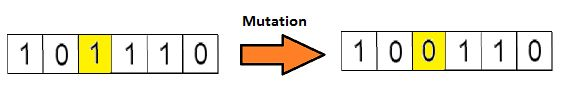

# 遗传算法

> Genetic Algorithm遵循适者生存, 优胜劣汰的原则, 是一类借鉴生物界自然选择和自然遗传机制的随机化搜索算法. 遗传算法模拟一个人工种群的进化过程, 通过选择(Selection), 交叉(Crossover), 变异(Mutation)等机制, 在每次迭代中都保留一组候选个体, 重复此过程, 种群经过若干代进化后, 理想情况下可以达到近似最优的状态.

## 起源

* 细胞是所有生物的基石, 在一个生物的任何一个细胞中, 都有着相同的一套染色体. 所谓染色体, 就是指由DNA组成的聚合体.

传统上看, 这些染色体可以被由数字0和1组成的字符串表达出来.

一条染色体由基因组成, 这些基因其实就是组成DNA的基本结构. DNA上的每个基因都编码了一个独特的形状.

## 定义

## 步骤

* 编码: 创造染色体
* 个体: 种群
* 适应度函数
* 遗传算子: 选择, 交叉, 变异
* 运行参数: 是否选择精英操作, 种群大小, 染色体长度, 最大迭代次数, 交叉概率, 变异概率

### 编码与解码

* 实现遗传算法的第一步就是明确对求解问题的编码和解码方式.
* 编码方式:
  * 实数编码: 直接用实数表示基因, 容易理解且不需要解码过程, 但是容易过早收敛, 从而陷入局部最优.
  * 二进制编码: 稳定性高, 种群多样性大, 但是需要的存储空间大, 需要解码且难以理解.

### 个体与种群

* 染色体表达了某种特征, 这种特征的载体称为个体.
* 一个个体里面有一条染色体, 许多个体组成了一个种群.

### 适应度函数

* 遗传算法中, 一个个体的好坏用适应度函数值来评价, 适应度函数值越大, 解的质量越高.
* 适应度函数是遗传算法进化的驱动力, 也是进行自然选择的唯一标准.

### 遗传算子

> 选择－优胜劣汰, 适者生存. 交叉－保证种群稳定, 朝着最优解的方向进化. 变异－保证种群多样性, 避免交叉可能产生的局部收敛.

* 种群一开始可能不是那么优秀, 因为个体的染色体串是随机生成的. 每一次进化都尽可能保留种群中的优秀个体. 并且在优秀个体之间进行染色体交叉, 有些个体还可能出现变异.
* 种群的每一次进化, 都会产生一个最优个体. 如果种群无休止的进化, 那么总会找到一个最优的个体.
* 选择
  * 选择操作是从前代种群中选择多对较优个体, 一对较优个体称之为一对父母, 让父母将它们的基因传递到下一代, 直到下一代个体数量达到种群数量上限.
  * 在选择操作前, 将种群中个体按照适应度从小到大进行排列.
  * 采用轮盘赌选择方法. 各个个体被选中的概率与其适应度函数值大小成正比.
  * 轮盘赌选择方法具有随机性, 在选择的过程中可能会丢掉较好的个体, 所以可以使用精英机制, 将前代最优个体直接选择.
* 交叉
  * 两个待交叉的不同的染色体根据交叉概率按某种方式交换其部分基因

    

    单点交叉, 随机选择一个交叉点然后将交叉点前后的染色体部分进行染色体间的交叉对调.

    

    多点交叉
* 变异
  * 染色体按照变异概率进行染色体的变异

    

  * 一般来说, 交叉概率比较大, 变异概率极小.

## 终止条件

* 在进行X次迭代之后, 总体没有什么太大的改变
* 事先为算法定义好进化的次数
* 适应度函数已经达到了预先定义的值

### 轮盘赌算法

* 将轮盘分成m个部分, m代表我们总体中染色体的个数, 每条染色体在轮盘上占有的区域面积将根据适应度分数成比例计算.

* 假设有如下轮盘:

  

  这里, 轮盘开始旋转我们把图中固定的指针(fixed point)直到的那片区域选为第一个亲本, 然后对于第二个亲本我们采取同样的操作.有时可以在图中标注两个固定的指针.

  

  ​

通过这种方法, 可以在一轮中就获得两个亲本, 将这种方法称为随机普遍选择法.