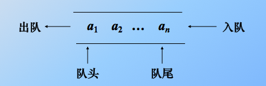
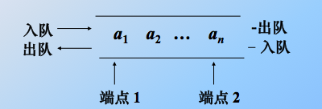
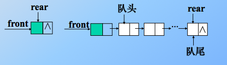
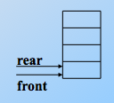
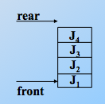
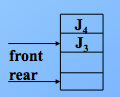
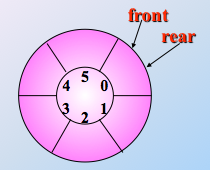
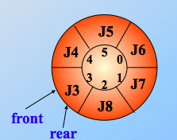

# Queue

* 队列

  * 限定在表的一端插入, 另一端删除. 插入的是队尾, 删除的是队头.

  * 先进先出(FIFO结构)

  * 当队列没有元素的时候, 那么就为空队列.

    

* 双端队列

  * 限定插入和删除在表的两端进行

    

  * 分类

    * 输入受限的双端队列: 一个端点可插入和删除, 另一个端点仅可删除.
    * 输出受限的双端队列: 一个端点可插入和删除, 另一个端点仅可插入.
    * 等价于两个栈底相连接的栈: 限定双端队列从某个端点插入的元素, 只能在此端点删除

## 链队

> 用链表表示的队列, 限制仅在表头删除和表尾插入的单链表. 一个队列由一个头指针和一个尾指针唯一确定,

* 为实现方便, 给链队列添加一个头结点, 那么空队列的判定条件是: 头指针和尾指针都指向头结点

  

* 实现

```c
#ifndef QUEUE_H_
#define QUEUE_H_

#include<stdio.h>
#include<stdlib.h>
#include<stdbool.h>

typedef struct Node{
    int data;
  	struct Node *next;
} Node, *Queue;

typedef struct{
    Queue front;
  	Queue rear;
}linkQueue;

/*
 *　初始化
 */
void initQueue(linkQueue *queue) {
    queue -> front = queue -> rear = (Queue)malloc(sizeof(Node));
  	if(NULL == queue -> front) {
        exit(1);
    }
  	queue -> front -> next = NULL;
  	queue -> rear -> next = NULL;
}

/*
 * 判空
 */
bool isEmpty(linkQueue *queue) {
    if(queue -> front == queue -> rear) {
        return true;
    } else {
        return false;
    }
}

/*
 * 入队
 */
void enterQueue(linkQueue *queue, int temp) {
  Queue node = (Queue)malloc(sizeof(Node));
  
  if(node) {
      node -> data = temp;
      node -> next = NULL;
  } else {
      exit(1);
  }
  
  queue -> rear -> next = node;
  queue -> rear = node;
}

/*
 * 出队
 */
void outQueue(linkQueue *queue) {
  	Queue temp = NULL;
  	
    if(isEmpty(queue)) {
        exit(1);
    } else {
      	if(queue -> front -> next == queue -> rear) {
            queue -> rear = queue -> front;
          	queue -> front -> next = NULL;
        } else {
      		temp = queue -> front -> next;
        	queue -> front = temp -> next;
        }
    }
  	
  	free(temp);
}

/*
 * 遍历
 */
void traversal(LinkQueue queue) {
  	Queue temp = queue.front -> next;
    while(temp) {
        printf("%d\t", temp -> data);
      	temp = temp -> next;
    }
}
#endif
```


## 顺序队列

* 限制仅在表头和表尾插入的顺序表, 利用一组地址连续的存储单元依次存放队列中的数据元素. 因为队头和队尾的位置是变化的, 所以也要有头尾指针.

* 初始化时的头尾指针, 初始值均应置为0. 头尾指针相等时队列为空, 在非空队列中, 头指针始终指向队头元素, 尾指针始终指向队尾元素的下一个位置.

  

  * 在顺序队列中, 当尾指针已经指向了队列的最后一个位置的下一个位置时, 若再有元素入队, 就会发生溢出

    


## 循环队列

* 顺序队列假溢出: 队列的存储空间未满, 却发生了溢出.

* 解决假溢出的办法:

  * 平移元素: 把元素平移到队列的首部

  * 循环使用: 将新元素插入到第一个位置上, 构成循环队列, 入队和出队仍按先进先出原则

    

* 判断空

  * 空队列

    

  * 满队列

    

  * 解决方法

    * 少用一个元素的空间, 约定入队前测试尾指针在循环下加1后是否等于头指针, 若想等则认为满.

* 实现

```c
#ifndef CIRCLE_QUEUE_H
#define CIRCLE_QUEUE_H

#include<stdio.h>
#include<stdlib.h>

#define MAX_SIZE 5

typedef struct{
    int *base;
  	int front;
  	int rear;
}CircleQueue;

/*
 * 初始化
 */
void initQueue(CircleQueue *queue) {
  queue -> base = (int*)malloc(sizeof(int) * MAX_SIZE);
  
  if(!queue -> base) {
      exit(1);
  } 
  
  queue -> front = queue -> rear = 0;
}

/*
 * 求长度
 */
int getLength(CircleQueue queue) {
    return (queue.rear - queue.front + MAX_SIZE) % MAX_SIZE;
}

/*
 * 入队
 */
void enterCircleQueue(CircleQueue *queue, int temp) {
    if((queue -> rear + 1) %　MAX_SIZE == queue -> front) {
        printf("队列已经满了\n");
    } else {
      	queue -> base[queue -> rear] = temp;
        queue -> rear = (queue -> rear + 1) % MAX_SIZE;
    }
}

/*
 * 出队
 */
void outCircleQueue(CircleQueue queue) {
    if(queue.front == queue.rear) {
        printf("空队列");
    } else {
        queue.front = (queue.front + 1) % MAX_SIZE;
    }
}

#endif
```

