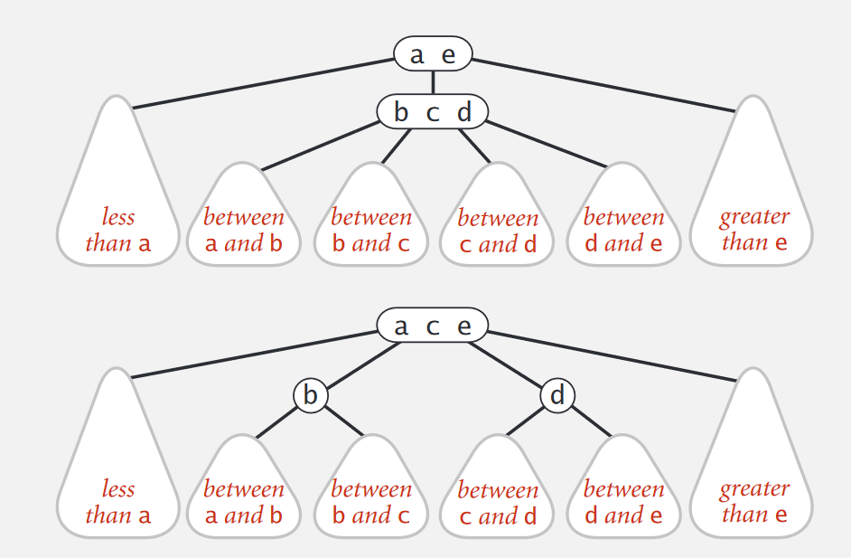

# 树

### 二叉查找树

#### 定义
1. 若任意节点的左子树不空, 则左子树上所有节点的值均小于它的根节点的值
2. 若任意节点的右子树不空, 则右子树上所有节点的值均大于它的根节点的值
3. 任意节点的左右子树也分别为二叉查找树
4. 没有键值相等的节点

#### 删除
1. 当节点是一片树叶时, 那么它可以被立即删除
2. 当节点有一个儿子时, 则该节点可以在其父节点调整指针绕过该节点后被删除
3. 当节点有两个儿子时, 一般的删除策略是用其右子树的最小的数据代替该节点的数据并递归地删除那个节点
4. 如果删除的次数不多, 通常使用的策略是懒惰删除. 当一个元素要被删除时, 它仍然留在树中, 只是做了一个被删除的记号.这种做法在有重复关键字的时候很实用.

### 二叉平衡树

#### 定义

  1. 平衡二叉树建立在二叉排序树的基础上, 目的是使二叉排序树的平均查找长度更小, 即让各节点的深度尽可能小. 因此, 树中每个节点的两棵子树的深度不要偏差太大.

  2. 平衡二叉树是一棵二叉树, 其可以为空. 或者满足以下两个条件

     左右子树深度之差的绝对值不大于1

     左右子树都是平衡二叉树

  3. **平衡因子**: 节点的平衡因子 = 节点左子树的深度 - 节点右子树的深度

  4. **最低不平衡点**: 用A表示最低不平衡点, 则A的祖先节点可能有不平衡的, 但是其所有后代节点都是平衡的.

  5. 平衡二叉树的深度接近$$log_2N$$的数量级, 从而保证在二叉排序树上插入, 删除和查找等操作的平均时间复杂度为$$O(log_2N)$$

#### 分析
> 把需要重新平衡的节点叫做$$\alpha$$. 由于任意节点最多有两个儿子, 因此高度不平衡时, $$\alpha$$点的两棵子树的高度2

1. 对$$\alpha$$的左儿子的左子树进行一次插入**LL型**
2. 对$$\alpha$$的左儿子的右子树进行一次插入**LR型**
3. 对$$\alpha$$的右儿子的左子树进行一次插入**RL型**
4. 对$$\alpha$$的右儿子的右子树进行一次插入**RR型**

1.4关于$$\alpha$$镜像对称, 2.3关于$$\alpha$$镜像对称

#### 实现

> 整个实现过程是通过在一棵平衡二叉树中依次插入元素, 若出现不平衡, 则要根据新插入节点与最低不平衡节点的位置关系进行相应的调整.分为LL, LR, RL, RR.(A为最低不平衡点)

**LL型**

在A的左孩子(L)的左子树(L)上插入新节点

调整方法: 

1. 将A的左孩子B提升为新的根节点
2. 将原来的根节点A降为B的右孩子
3. 各子树按大小关系连接(BL, AR不变. BR调整为A的左子树)

**RR型**

在A的右孩子(R)的右子树上插入新节点

调整方法

1. 将A的右孩子B提升为新的根节点
2. 将原来的根节点A降为B的左孩子
3. 各子树按大小关系连接(AL和BR保持不变, BL调整为A的右子树)

**LR型**

在A的左孩子(L)的右子树(R)上插入新节点

调整方法

1. 将C提升为根节点
2. 将原来的根节点A降为C的右孩子, 原来的节点B降为C的左孩子
3. 各子树按照大小关系连接(BL和AR保持不变, CL和CR分别调整为B的右子树和A的左子树)

**RL型**

在A的右孩子(R)的左子树(L)上插入新节点

调整方法

1. 将C提升为根节点
2. 将原来的根节点A降为C的左孩子, 原来的节点B降为C的右孩子
3. 各子树按大小关系连接(AL和BR保持不变, CL和CR分别调整为A的右子树和B的左子树)

#### 操作

1. 单旋转(左-左或右-右的情况): 插入操作发生在外部, 通过对树进行一次单旋转而完成调整

2. 双旋转(左-右或右-左的情况): 插入操作发生在内部, 通过对树进行一次双旋转而完成调整

### 2-3树

> 2-3树是一种阶为3的B树, 可以简单理解为3叉树. 2-3树的最大特点就是它一定是一棵完全3叉树, 即除了叶节点外, 其它的节点没有空儿子

1. 一种保持有序结构的查找树, 它允许一个节点中出现2个key
2. 可以维持动态平衡的有序查找树
3. 2节点: 1个key值, 2个孩子. 3节点: 2个key值, 3个孩子
4. 符合中序遍历的顺序: 左孩子小于最左的key, 中间孩子在左右key之间, 右孩子大于最右key
5. 绝对平衡: 从根节点到所有Null节点的路径是一样长的

#### 组成
2-3树的每个节点不一定只有一个键, 同时儿子的数量也有不同

**2-节点**

左子树的值比a小, 右子树的值比a大

**3-节点**

左子树的值比a小, 中间子树的值介于a-b之间, 右子树的值比b大

**4-节点**

用做中间节点, 在插入和删除过程中保持树的平衡

#### 操作

**构造**

**查找**

1. 如果小于左孩子, 往左走
2. 如果大于左孩子, 小于右孩子, 往中间走
3. 如果大于右孩子, 往右走
4. 如果等于key, 返回key值
5. 如果没有找到, 返回null值

**插入**

节点合并
  > 与二叉查找树一样, 我们通常都是在树的底部进行插入操作. 但是, 在插入操作之前, 2-3树是完美平衡的. 在底部插入一个节点之后就会导致底部多出一个节点, 导致2-3树不平衡. 所以在插入过程中需要对节点进行合并. 

1. 在一个2-节点的左边
2. 在一个2-节点的右边
3. 在一个3-节点的左边
4. 在一个3-节点的中间
5. 在一个3-节点的右边

节点分裂

  > 因为4-节点不能出现在最后的2-3树中, 所以需要对4-节点进行分解, 以确保2-3树的平衡

1. 因为4-节点出现在树的底部, 原地分裂会导致高度加1, 导致树的不平衡. 所以分解的过程中, **把a, c留在原处, 将b往上传, 与父节点进行合并**
2. 如果父节点在和b进行结合的时候出现4-节点的情况, 我们继续往上传递
3. 如果传递到根节点时出现和2中一样的情况, 这时可以生成一个新的根节点. 将整个树的高度加1. 

**删除**

### 红黑树

> 核心思想是用一条左倾链(红链)作为"胶水"把二叉树的两个节点给粘起来, 形成一个3节点

将红链看成水平线的话, 就类似于2-3树

* 约定: 
  * 每个节点最多只有一个红链与之相连(连接父亲和孩子)
  * 每条从root到null的路径, 都是同样的黑链数
  * 红链都在左边

#### 表示

> 在BST中加入一个用来表明链颜色的变量. 默认空链是黑色

#### 操作

**左旋**

**右旋**

**颜色翻转**

##### 引用

1. [平衡二叉树实现原理](https://blog.csdn.net/wxbmelisky/article/details/47755753)
2. [2-3树](http://voidsky.cc/tech/algorithm/algorithm_bst_1/)
3. [2-3树](https://riteme.github.io/blog/2016-3-12/2-3-tree-and-red-black-tree.html)
4. [2-3树的删除](https://blog.csdn.net/mengzhisuoliu/article/details/44752215)
5. [红黑树](http://voidsky.cc/tech/algorithm/algorithm_bst_2/)

